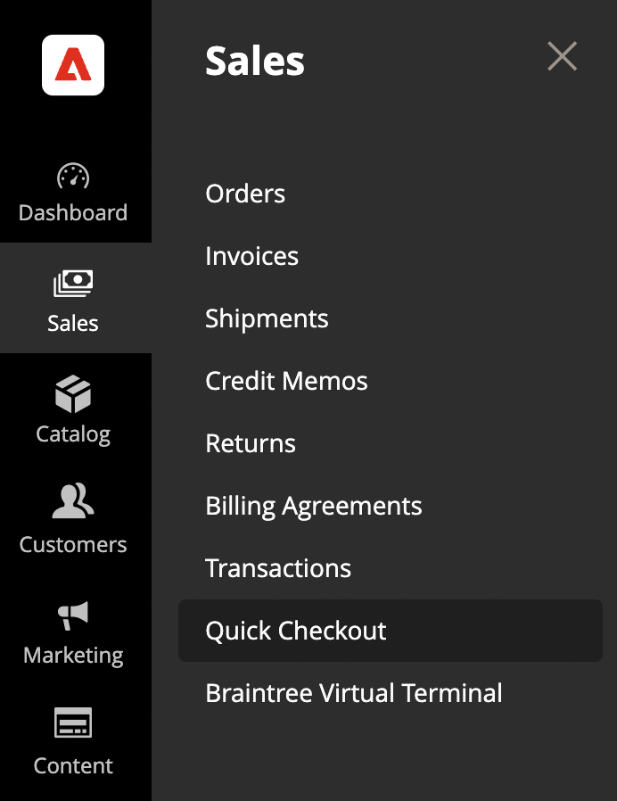

# Introduzione al [!DNL Quick Checkout] Pannello Admin

[!DNL Quick Checkout] per Adobe Commerce e Magenti Open Source fornisce una visualizzazione del pannello Amministratore con tutte le informazioni necessarie per configurare e utilizzare l’estensione .

1. Sulla _Amministratore_ barra laterale, vai a **[!UICONTROL Sales]** > **[!UICONTROL Quick Checkout]**:

   

1. In questa visualizzazione, puoi accedere al _Pannello Admin_ panoramica, _Risorse_ informazioni [!DNL Quick Checkout], get _Guida e supporto_ o configura l&#39;estensione tramite _Impostazioni_.

   

Verifica che l&#39;utente disponga dei ruoli e delle autorizzazioni appropriati per [!DNL Quick Checkout] Pannello Amministratore da visualizzare. Consulta la sezione [Ruoli utente e autorizzazioni](../quick-checkout/user-roles-setup.md) per ulteriori informazioni.

Fai riferimento a [Onboarding](../quick-checkout/onboarding.md) per ulteriori informazioni su come configurare il [!DNL Quick Checkout] per Adobe Commerce.

## Pagina principale

| Campo | Descrizione |
|---|---|
| [!UICONTROL Overview] | La scheda Panoramica mostra tutte le risorse per l’utilizzo di [!DNL Quick Checkout]. |
| [!UICONTROL Reports] | La scheda Rapporti presenta informazioni complete [!DNL Quick Checkout] informazioni. |

## Guida e supporto

| Campo | Descrizione |
|---|---|
| [!UICONTROL Troubleshooting guide] | Il Centro assistenza Adobe Commerce contiene [!DNL Quick Checkout] risoluzione dei problemi relativi agli articoli. |
| [!UICONTROL Feedback] | Fornisci un feedback al team. |

## Risorse

| Campo | Descrizione |
|---|---|
| [!UICONTROL Open documentation] | Consulta i documenti più recenti per [!DNL Quick Checkout]. |
| [!UICONTROL [!DNL Bolt] merchant dashboard] | Accedi alle [!DNL Bolt] conto commerciale e dashboard. |
| [!UICONTROL Release notes] | Scopri le ultime modifiche per [!DNL Quick Checkout]. |

## Impostazioni

Nella vista Pannello Amministratore, fai clic su **[!UICONTROL Settings]** per accedere al [!DNL Quick Checkout] configurazione. Vedi [Configurazione amministratore](onboarding.md#complete-admin-configuration) per ulteriori informazioni.