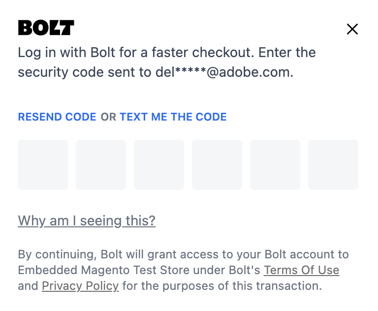

# Un utente Adobe Commerce esistente: come funziona

Un utente Adobe Commerce esistente può selezionare i dettagli di spedizione e pagamento salvati quando effettua un ordine con [!DNL Quick Checkout] per un’esperienza di pagamento più rapida.

Quando un acquirente immette il proprio indirizzo e-mail al momento del pagamento, il [!DNL Quick Checkout] lo convalida e trova un [!DNL Bolt] account.

## Utente registrato sia in Adobe Commerce che [!DNL Bolt]

Quando un acquirente è un utente registrato sia in Adobe Commerce che [!DNL Bolt] reti, entrambe le reti sono fornite memorizzato spedizione e dettagli di pagamento.

Se un [!DNL Bolt] account trovato durante il pagamento, gli acquirenti possono continuare con il loro [!DNL Quick Checkout] esperienza di pagamento senza soluzione di continuità:

1. Immettere la password monouso (OTP) inviata a tale [!DNL Bolt] indirizzo e-mail dell’account o cellulare, a seconda di [preferenze dell&#39;utente in [!DNL Bolt] account](https://help.bolt.com/shoppers/account/account-settings/#how-to-set-preferred-login-method){target=_blank}.

1. Una volta effettuato l’accesso con il tuo [!DNL Bolt] account, i dettagli vengono aggiunti automaticamente:

   - Informazioni spedizione
   - Metodo di pagamento

1. Effettua l’ordine.

>[!NOTE]
>
> La finestra a comparsa BULLONE OTP viene visualizzata solo quando l&#39;acquirente si trova nella pagina di pagamento. L’acquirente può scegliere di non effettuare l’accesso a Bolt chiudendo la finestra a comparsa.

Se l’acquirente ha effettuato l’accesso ad Adobe Commerce prima del pagamento, il [!DNL Bolt] La finestra a comparsa OTP non viene visualizzata durante il pagamento, ma viene visualizzato un messaggio che suggerisce all&#39;acquirente di accedere al proprio Portafoglio bulloni.

Se riscontri problemi quando effettui un ordine come utente Adobe Commerce esistente, consulta la sezione [Risoluzione dei problemi di Check-Out rapido](https://experienceleague.adobe.com/docs/commerce-knowledge-base/kb/troubleshooting/miscellaneous/quick-checkout-issues.html) nell’Aiuto di Adobe Commerce.

## Accesso automatico

Il componente Accesso automatico rileva quando un acquirente ha una sessione Bolt attiva e registra automaticamente l’accesso. In questo modo i passaggi di rilevamento account e codice di accesso una tantum vengono saltati perché l’acquirente li ha completati in una sessione precedente.

È possibile configurare un accesso automatico per [!DNL Quick Checkout] utenti. È possibile abilitare una configurazione per l&#39;accesso automatico di un utente durante l&#39;estrazione.

1. Il giorno _Amministratore_ barra laterale, passa a **Negozi** > **Configurazione** > **Pagamento** per accedere alla pagina di configurazione generale di amministrazione checkout.
1. In _Impostazioni servizio_ sezione per [!DNL Quick Checkout], fornire tutti i dettagli necessari per impostare l&#39;accesso automatico.

Consulta [[!DNL Quick Checkout] configurare le impostazioni del servizio](../quick-checkout/onboarding.md#configure-service-settings) per ulteriori informazioni.

>[!NOTE]
>
> Primo accesso al momento **accesso automatico** L&#39;opzione è abilitata richiede il consenso dell&#39;utente per autorizzarla accettando una finestra popup.

## Nuovo [!DNL Bolt] account

In caso negativo [!DNL Bolt] L’account viene trovato, gli acquirenti continuano con il pagamento predefinito di Adobe Commerce e selezionano tutte le informazioni necessarie dalle informazioni salvate per effettuare l’ordine:

- Informazioni su spedizione e fatturazione
- Metodo di spedizione
- Verifica metodo di pagamento
- Opzione per la registrazione [!DNL Bolt] consente di effettuare pagamenti più veloci prima di inoltrare l&#39;ordine. L&#39;acquirente può accettare i termini e le condizioni per creare il proprio [!DNL Bolt] account.

  ![Ricorda [!DNL Bolt]](assets/checkbox-remember-bolt.png)
