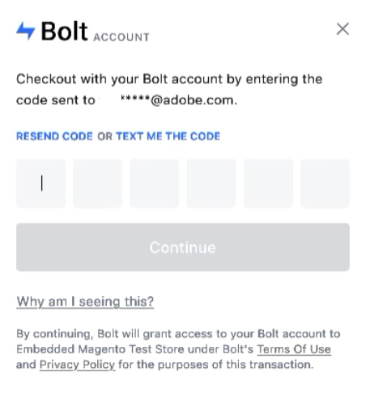

# Utenti ospiti

L’esperienza di pagamento per gli ospiti è diversa dall’esperienza utente Adobe. Quando un acquirente inserisce un indirizzo e-mail nel checkout, il [!DNL Quick Checkout] lo convalida e trova un [!DNL Bolt] conto.

## Registrato [!DNL Bolt] account

Se [!DNL Bolt] account trovato, gli acquirenti continuano con il loro [!DNL Quick Checkout] esperienza di pagamento diretta:

1. Inserisci la Password una tantum (OTP) inviata a [!DNL Bolt] indirizzo e-mail o mobile dell&#39;account, a seconda [preferenze dell&#39;utente nella [!DNL Bolt] account](https://help.bolt.com/shoppers/account/account-settings/#how-to-set-preferred-login-method){target=_blank}.

1. Una volta effettuato l&#39;accesso con il tuo [!DNL Bolt] account, i dettagli vengono aggiunti automaticamente:

   - Informazioni sulla spedizione
   - Metodo di pagamento

1. Ordinate.

>[!TIP]
>
> L’utente ospite inserisce l’ordine e può facoltativamente registrarsi in Adobe Commerce.

## Nuovo [!DNL Bolt] account

Se no [!DNL Bolt] viene trovato l&#39;account, gli acquirenti continuano con il loro checkout predefinito Adobe Commerce e l&#39;acquirente fornisce tutti i dettagli necessari per effettuare l&#39;ordine:

- Informazioni di spedizione e fatturazione
- Metodo di spedizione
- Revisione del metodo di pagamento
- Viene visualizzata una casella di controllo per la registrazione in [!DNL Bolt] per pagamenti più rapidi prima di effettuare l&#39;ordine. L&#39;acquirente può accettare i termini e le condizioni per creare le proprie [!DNL Bolt] conto.

   ![Ricorda [!DNL Bolt]](assets/checkbox-remember-bolt.png)

- L’utente ospite inserisce l’ordine e può facoltativamente registrarsi in Adobe Commerce.
