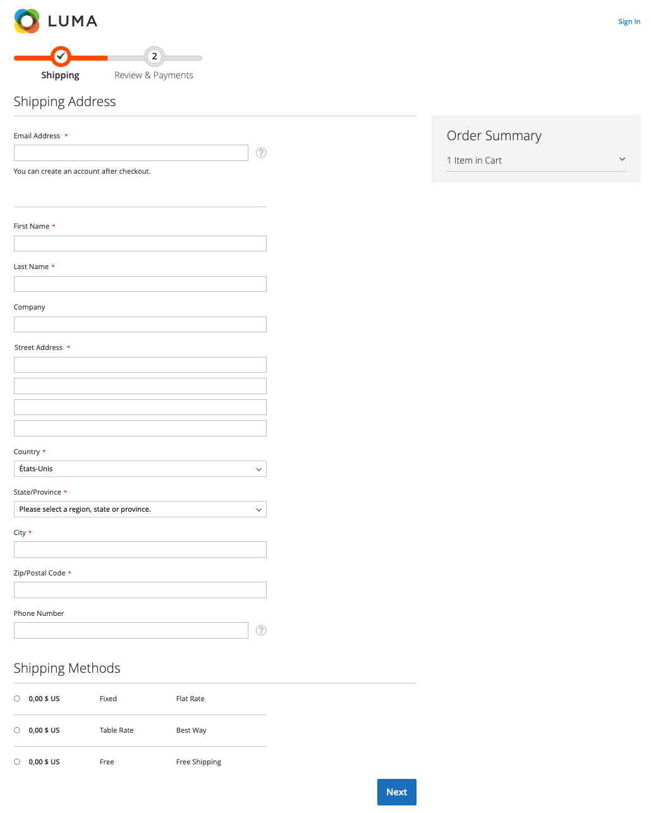

# Pagina Ritira in Adobe Commerce

La pagina di pagamento è il luogo in cui i clienti inseriscono le informazioni necessarie per effettuare un ordine.

Esempio di pagina di pagamento:

{width="600" zoomable="yes"}

Per ulteriori informazioni sulla pagina di pagamento standard di Adobe Commerce, consulta [pagina di pagamento](https://docs.magento.com/user-guide/quick-tour/checkout-page.html) argomento.

L’estrazione è costituita da due passaggi predefiniti:

- Informazioni spedizione
- Verifica e informazioni sul pagamento

>[!NOTE]
>
> Al termine del primo passaggio, vengono visualizzati i totali di pagamento e le informazioni sulla barra laterale corrispondenti.

Consulta la sezione [flusso di pagamento](../quick-checkout/checkout-flow.md) per ulteriori informazioni su [!DNL Quick Checkout] flusso.
