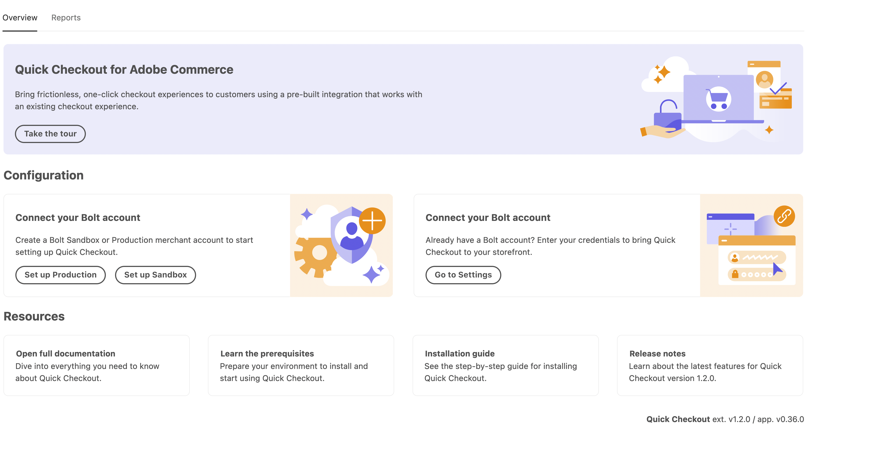
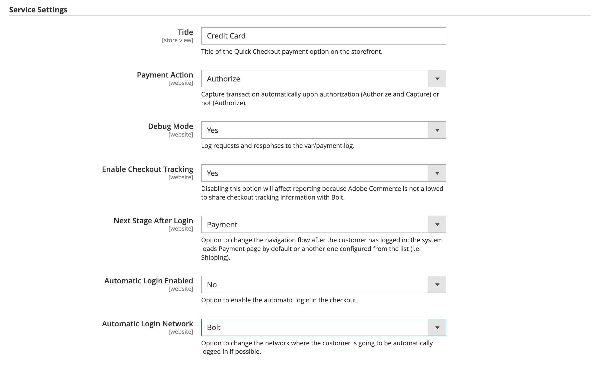

# [!DNL Quick Checkout] Onboarding

Per iniziare a utilizzare [!DNL Quick Checkout] per l’estensione Adobe Commerce, devi completare alcuni passaggi di onboarding per collegare la tua istanza con la nostra funzionalità di pagamento.

1. [Ottieni estensione](#get-extension).
1. [Crea un account commerciante di produzione o sandbox con [!DNL Bolt]](#create-account-with-bolt). Fornisci tutte le informazioni necessarie per verificare la tua identità.
1. [Fornisci l&#39;univoco [!DNL API Key] e [!DNL Publishable Key]](#obtain-api-credentials) generato in [!DNL Bolt].
1. [Impostare un provider di pagamenti in [!DNL Bolt] account](#configure-payment-providers).
1. [Imposta il menu a discesa Abilita su Sì](#enable-extension) per attivare l’estensione.
1. [Definire le impostazioni del servizio](#complete-admin-configuration) per configurare [!DNL Quick Checkout] estensione.
1. [Fai clic sul pulsante Salva configurazione](#enable-live-quick-checkout) per abilitare l&#39;estensione.
1. Cambia ambito in **Sito Web principale** e [fai clic sull’URL di callback Configure](#check-shopper-valid-account) pulsante.

Se Gainsight è abilitato, attiva la **Fai il tour** pulsante nel [!DNL Quick Checkout] Pannello di amministrazione informazioni su [!DNL Quick Checkout] per Adobe Commerce:

1. Il giorno _Amministratore_ barra laterale, vai a **[!UICONTROL Stores]** > **[!UICONTROL Configuration]** > Avanzate:

   

Se Gainsight non è abilitato, continua con i passaggi di onboarding.

Consulta la [[!DNL Quick Checkout] Pannello di amministrazione](../quick-checkout/admin-panel.md) per ulteriori informazioni.

>[!NOTE]
>
> Se non configuri il [!DNL Bolt] account non è possibile configurare gli ambienti sandbox o di produzione.

## Prerequisiti

Per utilizzare il [!DNL Quick Checkout], è necessario disporre dei seguenti elementi per [!DNL Bolt]:

- Provider di pagamenti supportati
- Conto esercente e produzione in [!DNL Bolt]
- API e [!DNL Publishable key] generato in [!DNL Bolt]

Consulta la sezione [prerequisiti](../quick-checkout/prerequisites.md) per ulteriori informazioni.

Consulta [Credenziali API](#obtain-api-credentials) per scoprire come creare o accedere al [!DNL API keys] per la tua istanza.

## Ottieni estensione

Consulta la [installare](../quick-checkout/install.md) per informazioni dettagliate su come ottenere l’estensione.

## Crea account con [!DNL Bolt]

Prima di configurare [!DNL Quick Checkout] nell’amministratore di Adobe Commerce è necessario per creare un’ [sandbox](https://merchant-sandbox.bolt.com/register?platform=magento2){target="_blank"} and [production](https://merchant.bolt.com/register?platform=magento2){target="_blank"}  account esercente in [!DNL Bolt]. Fornisci tutti i dettagli necessari per creare un account in [!DNL Bolt].

Consulta la sezione [testare e convalidare](../quick-checkout/testing.md) per ulteriori informazioni.

## Ottenere le credenziali API

Per utilizzare [!DNL Quick Checkout] hai bisogno di [!DNL Bolt] chiavi univoche e [!DNL signing secret]. Ottieni quanto segue [!DNL API keys] passando a **Sviluppatori** > **API** > **Chiavi** nel **Cruscotto del mercante di bulloni**.

- [!DNL API key]: chiave privata utilizzata dal back-end per interagire con [!DNL Bolt] API.
- [!DNL Publishable key]: chiave utilizzata dal front-end per interagire con [!DNL Bolt] API.
- [!DNL Signing secret]: utilizzato per la verifica della firma sulle richieste ricevute da [!DNL Bolt].

  

Consulta la [[!DNL Bolt] dettagli dell’ambiente](https://help.bolt.com/developers/references/environment-details/#about-keys){target="_blank"} pagina per informazioni sulle chiavi e sul segreto per la firma da [!DNL Bolt] per [!DNL Quick Checkout] estensione.

>[!CAUTION]
>
> È necessario creare [!DNL API keys] sia per gli ambienti sandbox che per quelli di produzione.

## Configurare i provider di pagamenti

Per connettere il provider di servizi di pagamento, eseguire le operazioni descritte nella [configurazione del processore](https://help.bolt.com/integrations/adobe-quick-checkout/set-up/){target="_blank"} sviluppatore [!DNL Bolt] pagina.

## Abilita estensione

1. Il giorno _Amministratore_ barra laterale, vai a **Negozi** > _Impostazioni_ > **Configurazione**.
1. Nel pannello a sinistra, espandi **Vendite** e seleziona **Pagamento**.
1. In [!DNL Quick Checkout] visualizza, imposta **Abilita** a `Yes`.

>[!CAUTION]
>
> I campi di estrazione rapida sono visibili solo quando **Abilita** è impostato su `Yes`.

1. Seleziona il metodo (Sandbox o Produzione) da utilizzare.

   - Sandbox a scopo di test e sviluppo
   - Produzione per elaborare le transazioni con il processore pagamenti live

1. Convalida le credenziali dopo aver fornito l’API univoca e [!DNL Publishable keys].

Consulta la sezione [Impostazioni](../quick-checkout/settings-quick-checkout.md) per ulteriori informazioni sulle opzioni di configurazione per [!DNL Quick Checkout] per l’estensione Adobe Commerce.

>[!CAUTION]
>
> Devi fornire un’API univoca e [!DNL Publishable] chiavi prima di abilitare l&#39;estensione altrimenti i clienti vedranno un modulo di pagamento e non potranno effettuare un ordine.

## Completa configurazione amministratore

1. Il giorno _Amministratore_ barra laterale, passa a **Negozi** > **Configurazione** > **Pagamento** per accedere alla pagina di configurazione generale di amministrazione checkout.
1. In _Impostazioni servizio_ , fornisci tutti i dettagli necessari per abilitare l&#39;estensione.
1. Imposta _Azione di pagamento_ in una delle due opzioni:

   - `Authorize`: non acquisire automaticamente la transazione al momento dell’autorizzazione.
   - `Authorize and Capture`: acquisisce automaticamente la transazione al momento dell’autorizzazione.

Per ulteriori informazioni sulle opzioni di pagamento standard di Adobe Commerce, consulta [pagamento](https://docs.magento.com/user-guide/configuration/sales/checkout.html) argomento.

## Abilita estrazione rapida live

Per attivare [!DNL Quick Checkout] per l’estensione Adobe Commerce:

1. Verifica che la [!UICONTROL Enable] menu a discesa impostato su **Sì** per attivare l’estensione.
1. Clic **Salva configurazione**.

## Verifica account valido per l&#39;acquirente

Per verificare se l&#39;acquirente ha [!DNL Bolt] account:

1. Cambia l&#39;ambito in **Sito Web principale**.
1. Fai clic su **Configurare l&#39;URL di richiamata** pulsante. Ciò consente [!DNL Bolt] per determinare se l’acquirente dispone di un account. In tal caso, viene visualizzata la finestra a comparsa OTP.

   >[!CAUTION]
   >
   > Passare all&#39;ambito **Sito Web principale** si assicura che sia impostato l’URL corretto. Ogni sito web potrebbe avere più domini.

Consulta la [Ambito sito, archivio e visualizzazione](https://experienceleague.adobe.com/docs/commerce-admin/start/setup/websites-stores-views.html#scope-settings){target="_blank"} per ulteriori informazioni sugli ambiti in Adobe Commerce.

## Configura impostazioni servizio

1. Imposta **Abilita tracciamento cassa** a `Yes`.

   >[!CAUTION]
   >
   > La disattivazione di questa opzione influisce sui rapporti perché Adobe Commerce non può condividere le informazioni di tracciamento dell’estrazione con Bolt.

1. Seleziona la **Fase successiva dopo l’accesso** per modificare il flusso di navigazione dopo che il cliente ha effettuato l’accesso. Per impostazione predefinita è impostato su **Pagamenti** pagina.
1. Definisci se [!DNL Quick Checkout] consente di **accesso automatico** durante il pagamento. Per impostazione predefinita, è abilitato all&#39;accesso automatico al [!DNL Bolt] rete.

   >[!NOTE]
   >
   > Consulta [Documentazione relativa all’abilitazione dell’accesso automatico di Bolt](https://help.bolt.com/products/embedded/direct-api/auto-login/) per ulteriori informazioni.

## Ottieni aiuto

Il processo di onboarding è concepito per guidarti attraverso i passaggi necessari per impostare e abilitare [!DNL Express Checkout] funzionalità.

Contatta il supporto Adobe Commerce tramite [Centro assistenza Adobe Commerce](https://experienceleague.adobe.com/docs/commerce-knowledge-base/kb/help-center-guide/magento-help-center-user-guide.html) per qualsiasi assistenza.

Consulta la [testare e convalidare](../quick-checkout/testing.md) per ulteriori informazioni.
