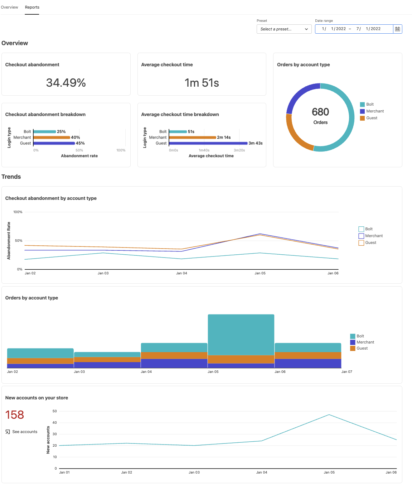
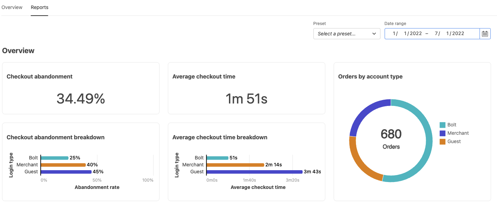
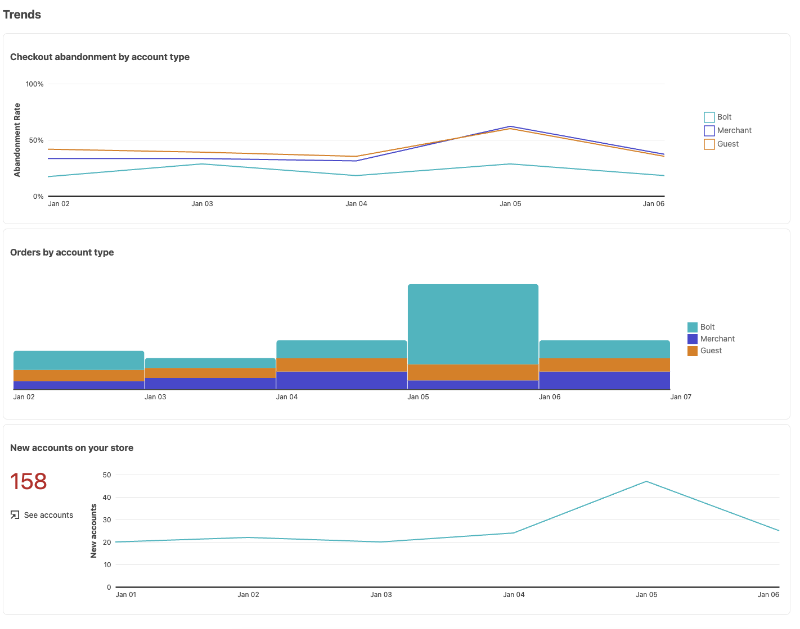
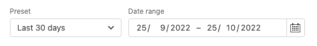

# Rapporti

[!DNL Quick Checkout] per Adobe Commerce e Magenti Open Source offre una funzione di reporting completa che ti permette di ottenere informazioni dettagliate sulle statistiche sull’esperienza di pagamento del tuo negozio.

>[!WARNING]
>
> Per consentire ad Adobe Commerce di condividere le informazioni di pagamento con Bolt, [**Tracciamento cassa**](../quick-checkout/settings-quick-checkout.md)  L&#39;impostazione deve essere abilitata in Admin. Per impostazione predefinita, questa opzione di configurazione è impostata su **Sì**. Se questa opzione è impostata su **No**, il reporting sarà interessato. Bolt aggiorna le informazioni di reporting una volta al giorno alle 03:00 ora solare orientale (EST).

## Rapporti di panoramica

I grafici nella sezione Panoramica mostrano informazioni dettagliate sulle prestazioni di pagamento del tuo negozio, tra cui il tempo medio di pagamento, i nuovi account creati durante il pagamento o l’abbandono dell’acquisto.

| Grafico | Descrizione |
|---|---|
| [!UICONTROL Checkout abandonment] | Percentuale di visitatori che escono dal processo di pagamento senza completare un acquisto. |
| [!UICONTROL Checkout abandonment breakdown] | L’abbandono del pagamento diviso per tipo di visitatore. La descrizione mostra una differenza percentuale tra Bullone e Ospite. Opzioni: [!UICONTROL Bolt] / [!UICONTROL Merchant] / [!UICONTROL Guest] |
| [!UICONTROL Average checkout time] | Il tempo medio impiegato da un visitatore per completare il processo di pagamento. |
| [!UICONTROL Average checkout time breakdown] | Tempo medio di pagamento diviso per tipo di visitatore. La descrizione mostra una differenza percentuale tra Bullone e Ospite. Opzioni: [!UICONTROL Bolt] / [!UICONTROL Merchant] / [!UICONTROL Guest] |
| [!UICONTROL Orders by account type] | Ordini inseriti divisi per tipo di visitatore. Opzioni: [!UICONTROL Bolt] / [!UICONTROL Merchant] / [!UICONTROL Guest] |

## Report tendenze

I grafici nella sezione Tendenze mostrano le tendenze dell’esperienza di pagamento filtrate per tipo di account o per i nuovi account creati durante il pagamento.

| Grafico | Descrizione |
|---|---|
| [!UICONTROL Checkout abandonment by account type] | Tendenza di abbandono pagamento divisa per tipo di visitatore. Opzioni: [!UICONTROL Bolt] / [!UICONTROL Merchant] / [!UICONTROL Guest] |
| [!UICONTROL Orders by account type] | Tendenza degli ordini effettuati divisa per tipo di visitatore. Opzioni: [!UICONTROL Bolt] / [!UICONTROL Merchant] / [!UICONTROL Guest] |
| [!UICONTROL New accounts on your store] | Nuovi account sulla tendenza del tuo negozio. |

## Filtrare i dati

Puoi filtrare i risultati mostrati per data o i predefiniti esistenti, ad esempio **Ultimi 30 giorni**.

| Campo | Descrizione |
|---|---|
| [!UICONTROL Preset] | Elenco a discesa che visualizza i predefiniti che possono essere utilizzati per mostrare intervalli di dati specifici. Per impostazione predefinita: ultimi 30 giorni |
| [!UICONTROL Date range] | Elenco a discesa che consente di selezionare un intervallo di dati specifico a seconda delle date selezionate. |
