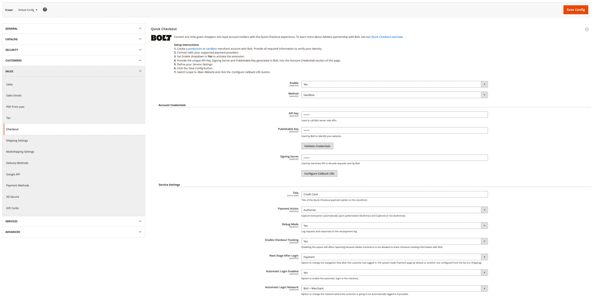
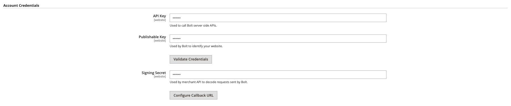
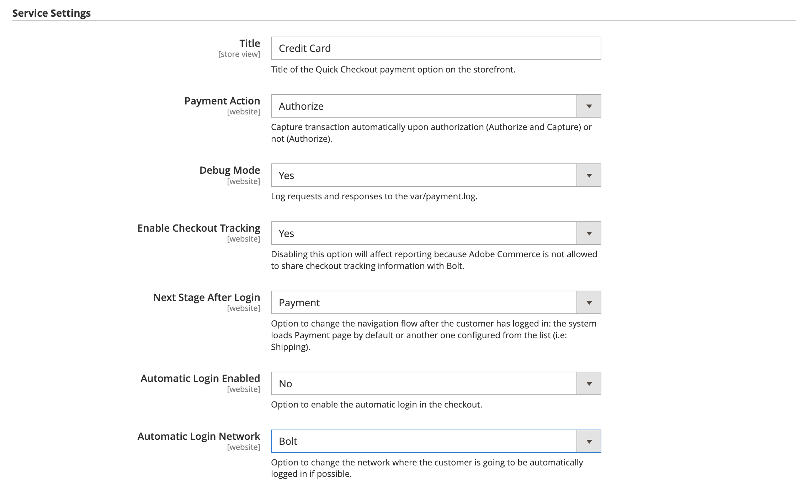

# [!DNL Quick Checkout] Impostazioni

[!DNL Quick Checkout] per Adobe Commerce e Magenti Open Source fornisce una vista di configurazione con tutte le informazioni necessarie per impostare l’estensione.

Per accedere a queste impostazioni di configurazione:

1. Il giorno _Amministratore_ barra laterale, vai a **Negozi** > _Impostazioni_ > **Configurazione**.
1. Nel pannello a sinistra, espandi **Vendite** e seleziona **Pagamento**.

   

Consulta la sezione [Onboarding](../quick-checkout/onboarding.md) per ulteriori informazioni su come configurare [!DNL Quick Checkout] per Adobe Commerce.

## Abilita estensione

| Campo | Ambito | Descrizione |
|---|---|---|
| [!UICONTROL Enable] | sito web | Attiva o disattiva [!DNL Quick Checkout] per il tuo sito web. Opzioni: [!UICONTROL Yes] / [!UICONTROL No] |
| [!UICONTROL Method] | sito web | Impostare il metodo o l&#39;ambiente per [!DNL Quick Checkout]. Opzioni: [!UICONTROL Sandbox] / [!UICONTROL Production] |

{style="table-layout:auto"}

## Credenziali account

| Campo | Ambito | Descrizione |
|---|---|---|
| [!UICONTROL API key] | sito web | Una chiave privata utilizzata dal back-end per interagire con [!DNL Bolt] API. |
| [!UICONTROL Publishable key] | sito web | Chiave utilizzata dal front-end per interagire con [!DNL Bolt] API. |
| [!UICONTROL Signing secret] | sito web | Utilizzato per la verifica della firma sulle richieste ricevute da [!DNL Bolt]. |

{style="table-layout:auto"}

## Impostazioni del servizio

| Campo | Ambito | Descrizione |
|---|---|---|
| [!UICONTROL Title] | visualizzazione store | Aggiungere il testo da visualizzare come titolo per questa opzione di pagamento nella vista Metodo di pagamento durante l&#39;estrazione. Opzioni: [!UICONTROL text field] |
| [!UICONTROL Payment Action] | sito web | Il [azione di pagamento](https://docs.magento.com/user-guide/configuration/sales/payment-methods.html#payment-actions){target="_blank"} per il metodo di pagamento specificato. Opzioni: [!UICONTROL Authorize] / [!UICONTROL Authorize and Capture] |
| [!UICONTROL Debug Mode] | sito web | Attiva o disattiva la modalità di debug. Opzioni: [!UICONTROL Yes] / [!UICONTROL No] |
| [!UICONTROL Enable checkout tracking] | sito web | Definisci se Adobe Commerce consente la condivisione delle informazioni di tracciamento del pagamento con Bullone. Abilitato per impostazione predefinita. Se disabilitato, il reporting sarà interessato. Opzioni: [!UICONTROL Yes] / [!UICONTROL No] |
| [!UICONTROL Next Stage After Login Mode] | sito web | Modifica il flusso di navigazione dopo l’accesso del cliente. Opzioni: [!UICONTROL Payment] / [!UICONTROL Shipping] |
| [!UICONTROL Automatic Login Enabled] | sito web | Definisci se [!DNL Quick Checkout] consente l&#39;accesso automatico durante il pagamento. Abilitato per impostazione predefinita. Opzioni: [!UICONTROL Yes] / [!UICONTROL No] |
| [!UICONTROL Automatic Login Network] | sito web | Seleziona la rete in cui il cliente effettua automaticamente l’accesso. Il bullone è attivato per impostazione predefinita. Opzioni: [!UICONTROL Bolt + Merchant] / [!UICONTROL Bolt] |

{style="table-layout:auto"}
