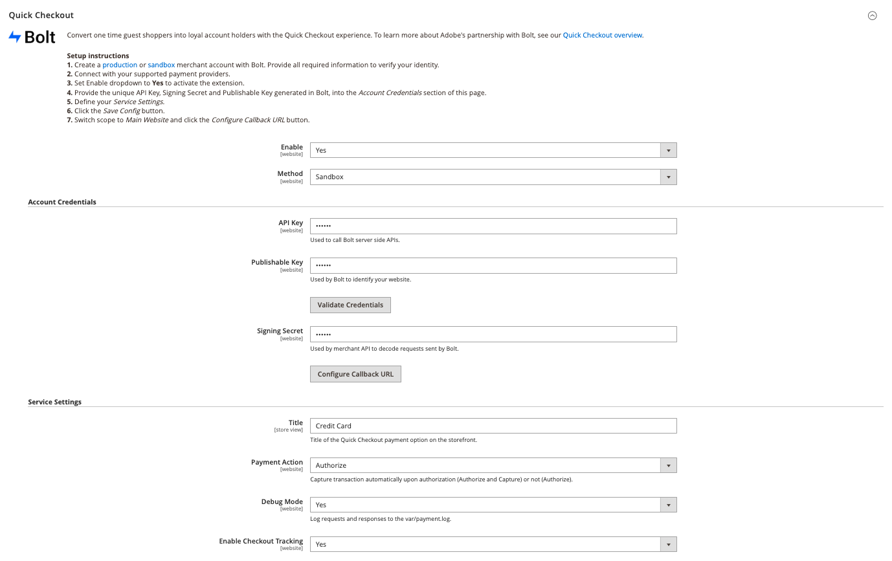

# [!DNL Quick Checkout] impostazioni

[!DNL Quick Checkout] per Adobe Commerce e Magenti Open Source fornisce una visualizzazione di configurazione con tutte le informazioni necessarie per configurare l&#39;estensione.

Per accedere alle seguenti impostazioni di configurazione:

1. Sulla _Amministratore_ barra laterale, vai a **Negozi** > _Impostazioni_ > **Configurazione**.
1. Nel pannello a sinistra, espandi **Vendite** e seleziona **Pagamento**.

   

Fai riferimento a [Onboarding](../quick-checkout/onboarding.md) per ulteriori informazioni su come configurare il [!DNL Quick Checkout] per Adobe Commerce.

## Abilita estensione

| Campo | Ambito | Descrizione |
|---|---|---|
| [!UICONTROL Enable] | sito web | Attiva o disattiva [!DNL Quick Checkout] per il sito web. Opzioni: [!UICONTROL Yes] / [!UICONTROL No] |
| [!UICONTROL Method] | sito web | Imposta il metodo o l&#39;ambiente per il tuo [!DNL Quick Checkout]. Opzioni: [!UICONTROL Sandbox] / [!UICONTROL Production] |

## Credenziali account

| Campo | Ambito | Descrizione |
|---|---|---|
| [!UICONTROL API key] | sito web | Una chiave privata utilizzata dal back end per interagire con [!DNL Bolt] API. |
| [!UICONTROL Publishable key] | sito web | Chiave utilizzata dal front-end per interagire con [!DNL Bolt] API. |
| [!UICONTROL Signing secret] | sito web | Utilizzato per la verifica della firma sulle richieste ricevute da [!DNL Bolt]. |

## Impostazioni del servizio

| Campo | Ambito | Descrizione |
|---|---|---|
| [!UICONTROL Title] | vista store | Aggiungere il testo da visualizzare come titolo per questa opzione di pagamento nella visualizzazione Metodo di pagamento durante il pagamento. Opzioni: [!UICONTROL text field] |
| [!UICONTROL Payment Action] | sito web | La [azione di pagamento](https://docs.magento.com/user-guide/configuration/sales/payment-methods.html#payment-actions){target=&quot;_blank&quot;} per il metodo di pagamento specificato. Opzioni: [!UICONTROL Authorize] / [!UICONTROL Authorize and Capture] |
| [!UICONTROL Debug Mode] | sito web | Attiva o disattiva la modalità di debug. Opzioni: [!UICONTROL Yes] / [!UICONTROL No] |
| [!UICONTROL Enable checkout tracking] | sito web | Definisci se Adobe Commerce consente di condividere le informazioni di tracciamento del checkout con Bolt. Abilitato per impostazione predefinita. Se disabilitata, la generazione di rapporti ne risentirà. Opzioni: [!UICONTROL Yes] / [!UICONTROL No] |
