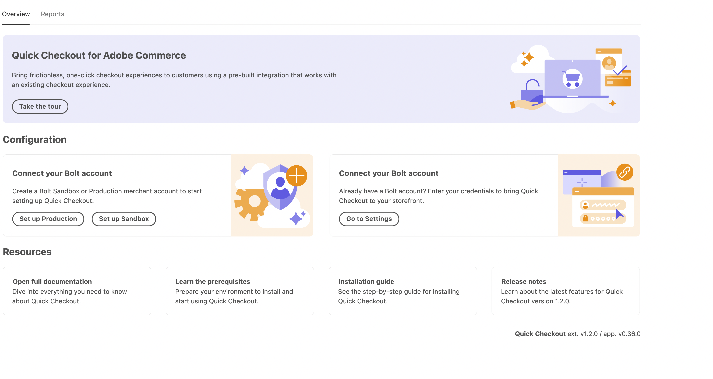
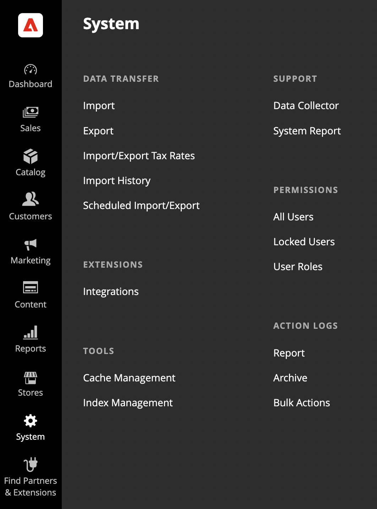
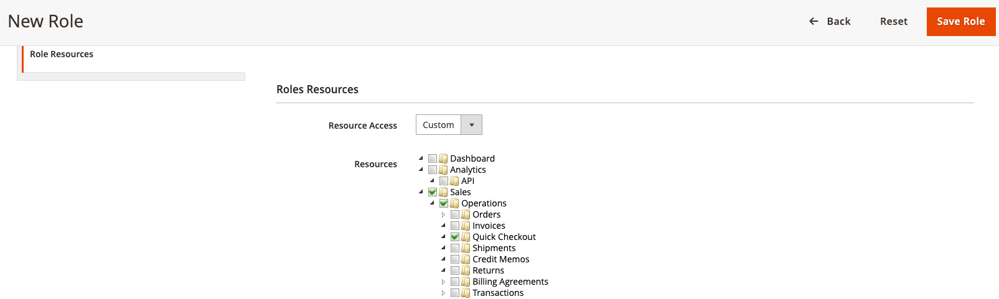

# [!DNL Quick Checkout] configurazione utente

[!DNL Quick Checkout] fornisce a un pannello Amministratore tutte le informazioni necessarie per iniziare l’onboarding, utilizzare l’estensione o includere risorse come l’accesso ai documenti, [!DNL Bolt] dashboard commerciale o note sulla versione.

Per accedere al [!DNL Quick Checkout] Pannello Amministratore:

1. Sulla _Amministratore_ barra laterale, passare a **[!UICONTROL Sales]** > **[!UICONTROL Quick Checkout]**.

   

Fai riferimento a [onboarding](../quick-checkout/onboarding.md) per ulteriori informazioni su come configurare il [!DNL Quick Checkout] per Adobe Commerce.

Per consentire all’utente l’accesso e la visibilità al [!DNL Quick Checkout] Nel pannello Amministratore, devi verificare che all’utente siano assegnate risorse di ruolo appropriate:

1. Sulla _Amministratore_ barra laterale, vai a **[!UICONTROL System]** > Autorizzazioni > **[!UICONTROL User Roles]**.

   

1. In _Ruoli_ visualizza, fai clic su **Aggiungi nuovo ruolo**
1. Seleziona la [!DNL Quick Checkout] risorse:

   

1. Fai clic su **Salva ruolo**.

Fai riferimento a [Ruoli utente](https://docs.magento.com/user-guide/system/permissions-user-roles.html) per ulteriori informazioni sulla definizione di un ruolo o sull’assegnazione di un ruolo a un utente.
