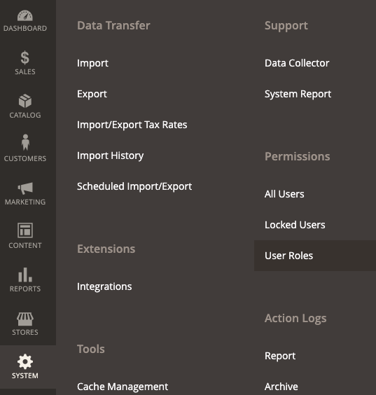

# [!DNL Quick Checkout] Configurazione utente

[!DNL Quick Checkout] fornisce a un pannello di amministrazione tutte le informazioni necessarie per avviare l’onboarding, utilizzando l’estensione o includendo risorse come l’accesso ai documenti, [!DNL Bolt] dashboard o note sulla versione di merchant.

Per accedere al [!DNL Quick Checkout] Pannello di amministrazione:

1. Il giorno _Amministratore_ barra laterale, passa a **[!UICONTROL Sales]** > **[!UICONTROL Quick Checkout]**.

   {width="600" zoomable="yes"}

Consulta la sezione [onboarding](../quick-checkout/onboarding.md) per ulteriori informazioni su come configurare [!DNL Quick Checkout] per Adobe Commerce.

Per consentire all&#39;utente di accedere e visualizzare [!DNL Quick Checkout] Pannello di amministrazione, è necessario verificare che all’utente siano state concesse le risorse ruolo appropriate:

1. Il giorno _Amministratore_ barra laterale, vai a **[!UICONTROL System]** > Autorizzazioni > **[!UICONTROL User Roles]**.

   {width="300" zoomable="yes"}

1. In _Ruoli_ visualizza, fai clic su **Aggiungi nuovo ruolo**
1. Seleziona la [!DNL Quick Checkout] risorse:

   {width="300" zoomable="yes"}

1. Clic **Salva Ruolo**.

Consulta la sezione [Ruoli utente](https://docs.magento.com/user-guide/system/permissions-user-roles.html) per ulteriori informazioni sulla definizione di un ruolo o sull&#39;assegnazione di un ruolo a un utente.
