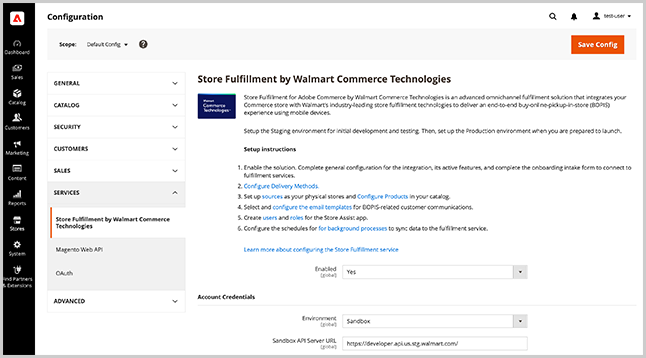
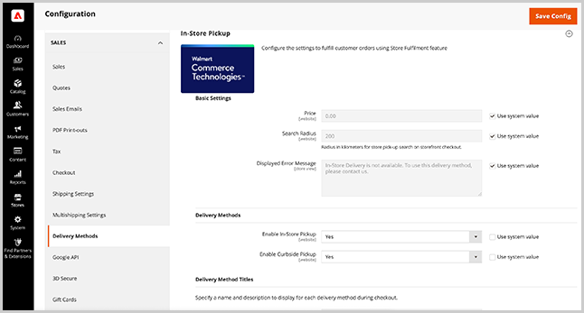

# Memorizza configurazione di servizio e vendite

Configura[!DNL Store Fulfillment] per abilitare l’estensione, specifica le impostazioni di estensione, configura le impostazioni di sicurezza per gli utenti dell’app Store Assist e imposta le opzioni per i metodi di consegna.

>[!IMPORTANT]
>
>La configurazione del servizio Store Fulfillment si applica solo dopo aver collegato la tua istanza Adobe Commerce e la [!DNL Store Fulfillment] app. Vedi [Esegui il programma Connect Store](connect-set-up-service.md).

Configura le impostazioni dei servizi di evasione dell&#39;archivio dal menu Configurazione dell&#39;archivio di amministrazione in Adobe Commerce.

Accedi alle impostazioni per abilitare l’estensione, configurare le impostazioni globali e specificare le opzioni di sicurezza per le connessioni utente e gli account dell’app Store Assist selezionando **[!UICONTROL Stores > Configuration > Services > Store Fulfillment by Walmart Commerce Technologies]**.

Accedi alle impostazioni per configurare i metodi di consegna selezionando **[!UICONTROL Store > Configuration > Sales > Delivery Methods > In-Store Pickup]**.

## Impostazioni di base

<table>
<thead>
<tr>
<td><strong>Campo</strong></td>
<td><strong>Descrizione</strong></td>
<td><strong>Ambito</strong></td>
<td><strong>Obbligatorio</strong></td>
</tr>
</thead>
<tbody>
<tr>
<td><strong>[!UICONTROL Price]</strong></td>
<td>Prezzo da pagare al cliente per il ritiro in negozio. Il valore predefinito è zero.</td>
<td>Sito Web</td>
<td>No</td>
</tr>
<tr>
<td><strong>[!UICONTROL Search Radius]</strong></td>
<td>Il raggio, in chilometri, da utilizzare quando un acquirente cerca una posizione di ritiro del negozio nel negozio di checkout. I risultati della ricerca restituiscono solo gli archivi situati entro il raggio di ricerca specificato.</td>
<td>Sito Web</td>
<td>No</td>
</tr>
<tr>
<td><strong>[!UICONTROL Displayed error message]</strong></td>
<td>Messaggio che viene visualizzato quando un cliente seleziona il ritiro in negozio, ma il metodo di consegna non è disponibile. Se necessario, è possibile personalizzare il testo predefinito.
</td>
<td>Visualizzazione store</td>
<td>No</td>
</tr>
</tbody>
</table>

>[!NOTE]
>
>La [!UICONTROL Search Radius] viene utilizzata solo se hai configurato il [posizione dell&#39;archivio e configurazione della mappatura](store-location-map-provider-setup.md) per Adobe Commerce.

## Abilita la soluzione Store Fulfillment

Abilita la [!DNL Store Fulfillment] soluzione per aggiungere le funzionalità di ritiro in-store e curbside alle esperienze di acquisto e pagamento nella tua vetrina Adobe Commerce.

<table>
<thead>
<tr>
<td><strong>Campo</strong></td>
<td><strong>Descrizione</strong></td>
<td><strong>Ambito</strong></td>
<td><strong>Obbligatorio</strong></td>
</tr>
 </thead>
 <tbody>
<tr>
<td><strong>[!UICONTROL Enabled]</strong></td>
<td>Abilita o disabilita la soluzione. Quando abilitato, configura e utilizza le funzionalità di Store Fulfillment e stabilisce la connessione tra i servizi Adobe Commerce Store e Store Fulfillment. Quando è disabilitata, tutte le funzioni di Store Fulfillment sono disabilitate e non vi è comunicazione tra Adobe Commerce e i servizi Store Fulfillment. Impossibile elaborare o ricevere le informazioni sull'ordine.</td>
<td>Globale</td>
<td>Sì</td>
</tr>
</tbody>
</table>

## Aggiungi credenziali account

<table>
<tr>
<td><strong>Campo</strong></td>
<td><strong>Descrizione</strong></td>
<td><strong>Ambito</strong></td>
<td><strong>Obbligatorio</strong></td>
    </tr>
<tr>
<td><strong>[!UICONTROL Environment]</strong></td>
<td>Seleziona o <i>Sandbox</i> o <i>Produzione</i>   Sandbox comunica con i servizi di evasione in un test.La produzione comunica con un ambiente live. Utilizzo <strong>only</strong> in produzione.  Puoi assegnare un set di credenziali per ogni ambiente e gestire entrambi i set nella stessa installazione.   Salvare le credenziali prima di convalidare la connessione.</td>
<td>Globale</td>
<td>Sì</td>
    </tr>
<tr>
<td><strong>[!UICONTROL API Server URL]</strong></td>
<td>URL dell’endpoint API per l’evasione di Walmart Store. Deve essere l’URL completo fornito durante il processo di onboarding. I clienti Store Fulfillment ricevono sia un URL Sandbox che di Produzione. Assicurati di copiare/incollare l’URL completo, inclusa la barra finale "/".</td>
<td>Globale</td>
<td>Sì</td>
    </tr>
<tr>
<td><strong>[!UICONTROL Token Auth Server URL]</strong></td>
<td>L'URL dell'endpoint di autenticazione per l'evasione dell'archivio Walmart. Il valore deve essere l’URL completo fornito durante il processo di onboarding. Ricevi sia un URL Sandbox che di produzione. Assicurati di copiare/incollare l'URL completo, inclusa la barra finale "/`".</td>
<td>Globale</td>
<td>Sì</td>
    </tr>
<tr>
<td><strong>[!UICONTROL Merchant Id]</strong></td>
<td>L’ID commerciante (tenant) univoco fornito durante il processo di onboarding. L'ID viene utilizzato per instradare gli ordini e assicura che i negozi commerciali li ricevano.</td>
<td>Globale</td>
<td>Sì</td>
    </tr>
<tr>
<td><strong>[!UICONTROL Consumer Id]</strong></td>
<td>L'ID di integrazione univoco. Questo viene fornito durante il processo di onboarding. Non cambia. Viene utilizzato per autenticare tutte le comunicazioni con i servizi di evasione.</td>
<td>Globale</td>
<td>Sì</td>
    </tr>
<tr>
<td><strong>[!UICONTROL Consumer Secret]</strong></td>
<td>Chiave di integrazione univoca. Questo viene fornito durante il processo di onboarding. Viene utilizzato per autenticare tutte le comunicazioni con i servizi di evasione.</td>
<td>Globale</td>
<td>Sì</td>
    </tr>
</table>

Dopo aver configurato le credenziali account, seleziona <strong>[!UICONTROL Validate Credentials]</strong> per verificare e stabilire una connessione al servizio Web di evasione per la prima volta.

## Configurare la registrazione

Quando la registrazione è abilitata, il file di registro può espandersi rapidamente. Per evitare problemi di tempo di risposta negli ambienti di produzione, fai attenzione ad abilitare la registrazione e attiva solo per un breve periodo di tempo quando necessario.

Chiedi all’amministratore di sistema di configurare gli ambienti per consentire la gestione delle eccezioni in modo che le eccezioni relative alle API possano essere acquisite tramite il firewall o la cache. È inoltre possibile chiedere all&#39;amministratore di sistema di impostare la rotazione del registro su questo file per ridurre al minimo le dimensioni.

<table>
<thead>
<tr>
<td><strong>Campo</strong></td>
<td><strong>Descrizione</strong></td>
<td><strong>Ambito</strong></td>
<td><strong>Obbligatorio</strong></td>
</tr>
</thead>
<tbody>
<tr>
<td><strong>[!UICONTROL Debug Mode]</strong></td>
<td>La modalità Debug viene utilizzata per aumentare l'attività registrata all'interno dell'integrazione. Se disabilitata, non vengono registrate informazioni di debug. Quando abilitata, tutte le informazioni di debug vengono registrate. Tutti i dati registrati si trovano nel file : `var/log/walmart-bopis.log`</td>
<td>Globale</td>
<td>No</td>
</tr>
</tbody>
</table>

## Gestisci sincronizzazione ordine

Configura le impostazioni per gestire gli errori per la sincronizzazione degli ordini, gli attributi del catalogo da utilizzare per la scansione dei codici a barre durante il prelievo degli ordini e configura le dimensioni dei batch degli ordini per la coda di evasione degli archivi.

Puoi visualizzare i dettagli sulle operazioni di sincronizzazione degli ordini dal dashboard Gestione code di evasione archivio nell&#39;Admin (
<strong>[!UICONTROL System > Tools > Store Fulfillment Queue]</strong>).

### Gestione degli errori di sincronizzazione

<table>
<tr>
<td><strong>Campo</strong></td>
<td><strong>Descrizione</strong></td>
<td><strong>Ambito</strong></td>
<td><strong>Obbligatorio</strong></td>
</tr>
<tr>
<td><strong>[!UICONTROL Retry Critical Error]</strong></td>
<td>Specifica i tentativi per un'operazione di sincronizzazione dei record dopo un errore critico.  Errori critici si verificano ogni volta che l'integrazione non riceve una risposta positiva dal servizio di evasione. Ciò può verificarsi quando il servizio è inattivo o quando si verifica un errore nei dati dell’ordine che si inviano.  Una volta raggiunta la soglia per i tentativi, l’elemento rimane in una coda ma non viene elaborato di nuovo. Visualizza tutti gli elementi con errori da <strong>[!UICONTROL System > Tools > Store Fulfillment Queue]</strong> Gestione in Admin. Per risolvere i problemi relativi agli elementi che si verificano con regolarità, contatta il tuo Account Manager.</td>
<td>Globale</td>
<td>No</td>
</tr>
<tr>
<td><strong>[!UICONTROL Enable Error Notification Email]</strong></td>
<td>Abilitare le notifiche di errore per ricevere un messaggio e-mail quando la variabile [!UICONTROL Retry Critical Error Threshold] viene raggiunto per un ordine. La notifica include tutti i dettagli disponibili sull’errore.</td>
<td>Globale</td>
<td>No</td>
</tr>
<tr>
<td><strong>[!UICONTROL Send Error Notification Email To]</strong></td>
<td>Elenco delimitato da virgole degli indirizzi e-mail dei destinatari per le notifiche di errore.</td>
<td>Globale</td>
<td>No</td>
</tr>
<tr>
<td><strong>[!UICONTROL Order Sync Exception Email Template]</strong></td>
<td>Specifica il modello e-mail utilizzato per avvisare i destinatari degli errori di sincronizzazione dell’ordine. Viene fornito un modello predefinito. Non supporta la personalizzazione.</td>
<td>Visualizzazione store</td>
<td>No</td>
</tr>
</table>

### Sincronizzazione degli ordini

<table>
<thead>
<tr>
<td><strong>Campo</strong></td>
<td><strong>Descrizione</strong></td>
<td><strong>Ambito</strong></td>
<td><strong>Obbligatorio</strong></td>
</tr>
</thead>
<tbody>
<tr>
<td><strong>[!UICONTROL Barcode Source]</strong></td>
<td>L'attributo di catalogo che memorizza il codice scannable per gli articoli corrispondenti nelle posizioni degli esercenti.  Se disponi di una sola posizione commerciale esistente, è probabile che tu utilizzi i codici UPC, mentre il tuo canale di e-commerce identifica i prodotti per SKU. Se questo è il tuo scenario, seleziona l'attributo di catalogo che contiene il codice UPC.  Questa impostazione assicura che gli ordini inviati ai punti vendita elenchi con l'identificatore corretto in modo che gli associati all'archivio possano eseguire una scansione accurata degli elementi durante il processo di prelievo.  Se non sei sicuro, controlla con i tuoi associati di evasione nel reparto Spedizione e prelievo per determinare quale attributo deve essere inviato. Potrebbe essere necessario aggiungere l'attributo appropriato al set di attributi di prodotto Adobe Commerce se l'attributo non è attualmente incluso nel database.</td>
<td>Sito Web</td>
<td>Sì</td>
</tr>
<tr>
<td><strong>[!UICONTROL Barcode Type]</strong></td>
<td>Attributo di catalogo che memorizza l’origine del codice a barre per gli articoli corrispondenti nelle posizioni degli esercenti.  Questa impostazione assicura che gli ordini inviati ai punti vendita elenchi con l'identificatore corretto in modo che gli associati all'archivio possano eseguire una scansione accurata degli elementi durante il processo di prelievo. Le opzioni includono: SKU, UPC, GTIN, UPCA, EAN13, UPCE0, DISA, UAB, CODABAR, Price Embedded UPC.  Se non sei sicuro, seleziona l’opzione che assomiglia maggiormente ai valori contenuti nel tuo [!UICONTROL Barcode Source] attributo. I collaboratori dello store possono comunque corrispondere gli elementi manualmente dal loro elenco di selezione.</td>
<td>Sito Web</td>
<td>Sì</td>
</tr>
<tr>
<td><strong>[!UICONTROL Max Number of Items]</strong></td>
<td>Il numero massimo di elementi da inviare contemporaneamente dalla coda di evasione dell'archivio.  Gli ordini BOPIS vengono inviati al servizio di evasione a intervalli regolari in batch. Questa impostazione consente di controllare le dimensioni del batch.  Il valore predefinito è 100 elementi. A seconda del volume e della capacità dell'ordine, potrebbe essere necessario regolare questo valore in alto o in basso.</td>
<td>Globale</td>
<td>No</td>
</tr>
</tbody>
</table>

## Abilita opzioni di spedizione per l&#39;evasione del negozio

Configura le opzioni di spedizione Store Fulfillment che determinano la disponibilità delle opzioni di ritiro in negozio e consegna a domicilio per i tuoi negozi Adobe Commerce.

### Negozio di spedizione

<table>
<thead>
<tr>
<td><strong>Campo</strong></td>
<td><strong>Descrizione</strong></td>
<td><strong>Ambito</strong></td>
<td><strong>Obbligatorio</strong></td>
</tr>
</thead>
<tbody>
<tr>
<td><strong>[!UICONTROL Enable Ship To Store]</strong></td>
<td>L'impostazione "nave-to-store" si basa sulle capacità esistenti di spedizione-to-store. Se utilizzi Inventory management o se puoi accettare e soddisfare ordini in posizioni commerciali senza inventario tramite trasferimenti di inventario da negozio a negozio, imposta questa opzione su "Sì".  Se non è possibile supportare l'opzione di consegna al negozio o non si desidera offrirla, impostare su "No". Se disabilitata, gli articoli nel catalogo con inventario zero per un negozio di merchant o quelli che si trovano al di sotto di tale posizione [!DNL Out of Stock Threshold], non sono offerte con opzioni di ritiro in negozio.  Si tratta di un’impostazione globale che può essere regolata in base alla posizione del commerciante.</td>
<td>Globale</td>
<td>No</td>
</tr>
</tbody>
</table>

### Negozio a partire da spedizione

<table>
<thead>
<tr>
<td><strong>Campo</strong></td>
<td><strong>Descrizione</strong></td>
<td><strong>Ambito</strong></td>
<td><strong>Obbligatorio</strong></td>
</tr>
</thead>
<tbody>
<tr>
<td><strong>[!UICONTROL Enable Ship From Store]</strong></td>
<td>Abilita o disabilita l’opzione Consegna iniziale negli archivi commerciali. Quando abilitata, le posizioni del tuo negozio di esercenti sono considerate in aggregato con altre sorgenti assegnate nel stock associato al tuo sito web.  Nei servizi Inventory management standard, la [!DNL Ship from Store] l’opzione è intrinseca e non può essere disabilitata. Con la soluzione Store Fulfillment, è possibile attivarla o disattivarla.  Questa è un'impostazione globale. È inoltre possibile regolare questa impostazione per posizione e prodotto mercante.</td>
<td>Globale</td>
<td>No</td>
</tr>
</tbody>
</table>

## Gestisci account e autorizzazioni per l&#39;utilizzo dell&#39;app dell&#39;archivio

Configura le impostazioni per l’account utente dell’app di evasione archivio e la sicurezza della password e l’autenticazione a due fattori.

### App Security

<table>
<thead>
<tr>
<td><strong>Campo</strong></td>
<td><strong>Descrizione</strong></td>
<td><strong>Ambito</strong></td>
<td><strong>Obbligatorio</strong></td>
</tr>
 </thead>
 <tbody>
<tr>
<td><strong>[!UICONTROL User Session Lifetime]</strong></td>
<td>L'intervallo di tempo, in secondi, in cui una sessione utente associata allo store rimane attiva prima del logout automatico. I valori validi sono compresi tra 60 e 31536000.</td>
<td>Globale</td>
<td>No</td>
</tr>
<tr>
<td><strong>[!UICONTROL Maximum Login Failures to Lockout Account]</strong></td>
<td>Specifica il numero di tentativi di accesso non riusciti consentiti prima che un associato dello store venga bloccato dal proprio account.  Per disattivare il blocco degli account, imposta il valore su 0.</td>
<td>Globale</td>
<td>No</td>
</tr>
<tr>
<td><strong>[!UICONTROL Lockout Time (minutes)]</strong></td>
<td>Numero di minuti per bloccare un account dopo un errore di accesso.</td>
<td>Globale</td>
<td>No</td>
</tr>
<tr>
<td><strong>[!UICONTROL Force Password Change]</strong></td>
<td>Determina se è richiesta una modifica della password utente.  "Sì": Richiedi all'utente di cambiare la password dopo la configurazione dell'account.`No`: Consiglia all'utente di cambiare la password dopo la configurazione dell'account.</td>
<td>Globale</td>
<td>No</td>
</tr>
<tr>
<td><strong>[!UICONTROL Password Lifetime]</strong></td>
<td>Il numero di giorni in cui una password rimane valida prima della modifica della password richiesta. Lascia vuoto per disabilitare questa opzione.</td>
<td>Globale</td>
<td>No</td>
</tr>
</tbody>
</table>

### Autenticazione a due fattori

<table>
<thead>
<tr>
<td><strong>Campo</strong></td>
<td><strong>Descrizione</strong></td>
<td><strong>Ambito</strong></td>
<td><strong>Obbligatorio</strong></td>
</tr>
 </thead>
 <tbody>
<tr>
<td><strong>[!UICONTROL APP User 2FA]</strong></td>
<td>Abilita o disabilita l’autenticazione a due fattori per gli associati allo store. Quando è abilitata, all'associazione store viene richiesto di fornire una password una tantum generata da un provider di autenticazione.</td>
<td>Globale</td>
<td>No</td>
</tr>
<tr>
<td><strong>[!UICONTROL APP 2FA Policy]</strong></td>
<td>Imposta i criteri di imposizione per l’autenticazione a due fattori.  <strong>[!UICONTROL Optional]</strong>: L'associazione allo store può ignorare l'autenticazione a due fattori se non è impostato alcun provider.  <strong>[!UICONTROL Mandatory]</strong>: L'associazione allo store è necessaria per completare l'autenticazione a due fattori.</td>
<td>Globale</td>
<td>No</td>
</tr>
<tr>
<td><strong>[!UICONTROL 2FA Providers]</strong></td>
<td>Selezionare uno o più servizi del provider di autenticazione per offrire ai collaboratori dello store. Per impostare l’autenticazione e l’autenticazione a due fattori, gli associati allo store devono installare l’app di autenticazione da uno dei provider disponibili installati sui propri dispositivi mobili.</td>
<td>Globale</td>
<td>No</td>
</tr>
</tbody>
</table>

## Metodi di Consegna

L&#39;evasione dello store funziona estendendo il Adobe Commerce nativo [!DNL In-Store Delivery] funzionalità.
Dopo aver installato l’estensione, sono disponibili ulteriori opzioni di configurazione amministratore per i metodi di consegna in-store. Configura queste opzioni aggiuntive dall’amministratore selezionando <strong>[!UICONTROL Stores > Configuration > Sales > Delivery Methods > In-Store Pickup]</strong>.

Nelle impostazioni Store Fulfillment (Esegui evasione archivio), puoi configurare i seguenti metodi di consegna per gli ordini In-Store Pickup.

- **Ritiro in negozio**- Opzioni di offerta per la consegna in negozio durante il processo di pagamento Questo è lo scenario di consegna più comune per gli ordini BOPIS.

- **Curbside pick**- Opzioni di offerta per i clienti per parcheggiare in una posizione del negozio e far loro consegnare il loro ordine da un associato del negozio.

>[!NOTE]
>
>Per ulteriori informazioni sulla configurazione delle opzioni di consegna in-store, vedi [Consegna in-store](https://docs.magento.com/user-guide/shipping/shipping-in-store-delivery.html) nella Guida utente di Adobe Commerce.

### Configurazione dei metodi di consegna

Con il metodo di consegna in-store, il cliente può selezionare un&#39;origine da utilizzare come posizione di ritiro durante il pagamento.

<table>
<thead>
<tr>
<td><strong>Campo</strong></td>
<td><strong>Descrizione</strong></td>
<td><strong>Ambito</strong></td>
<td><strong>Obbligatorio</strong></td>
</tr>
 </thead>
 <tbody>
<tr>
<td><strong>[!UICONTROL Enable In-Store Pickup]</strong></td>
<td>Attiva o disattiva l'opzione di ritiro in negozio disponibile durante il pagamento per i clienti che scelgono il ritiro dal negozio. Quando il ritiro in negozio è disattivato, l’opzione non viene visualizzata.  Questa impostazione globale si applica a tutte le posizioni dei punti vendita al dettaglio. Quando abilitato, puoi disattivarlo in modo selettivo nella posizione del negozio.</td>
<td>Sito Web</td>
<td>No</td>
</tr>
<tr>
<td><strong>[!UICONTROL Enable Curbside Pickup]</strong></td>
<td>Attiva o disattiva l'opzione di prelievo sul lato curvo durante il processo di pagamento per i clienti che scelgono il ritiro dal negozio.  Questa impostazione globale si applica a tutte le posizioni dei punti vendita al dettaglio. Quando abilitato, puoi disattivarlo in modo selettivo nella posizione del negozio.</td>
<td>Sito Web</td>
<td>No</td>
</tr>
</tbody>
</table>

### Configurazione del titolo del metodo di consegna

<table>
<thead>
<tr>
<th><strong>Campo</strong></th>
<th><strong>Descrizione</strong></th>
<th><strong>Ambito</strong></th>
<th><strong>Obbligatorio</strong></th>
</tr>
</thead>
<tbody><tr>
<td><strong>Titolo della consegna casa</strong></td>
<td>Specifica il titolo da visualizzare per l'opzione Consegna iniziale nelle aree di prodotto, carrello e pagamento. La consegna a domicilio si riferisce alle capacità di spedizione standard di Adobe Commerce, da un magazzino, da un vettore o direttamente all'indirizzo di spedizione fornito dal cliente.  Questa etichetta non influisce sul vettore di spedizione selezionato o sulle relative etichette del metodo di spedizione disponibili.</td>
<td>Visualizzazione store</td>
<td>No</td>
</tr>
<tr>
<td><strong>Descrizione della consegna</strong></td>
<td>Una descrizione facoltativa che viene visualizzata ogni volta che il Titolo della consegna principale viene mostrato ai clienti. Nella maggior parte dei casi, la descrizione è un messaggio statico per comunicare le promesse di consegna. Alcuni esempi: <code>Same-day shipping on orders by 4</code>  <code>Ships within 2 business days</code></td>
<td>Visualizzazione store</td>
<td>No</td>
</tr>
<tr>
<td><strong>Titolo del ritiro store</strong></td>
<td>Quando a un cliente vengono presentate le opzioni di consegna ed è disponibile il ritiro in negozio, viene visualizzata questa etichetta.  Puoi personalizzare questa etichetta, che viene visualizzata nelle aree prodotto, carrello e pagamento.</td>
<td>Visualizzazione store</td>
<td>No</td>
</tr>
<td><strong>Descrizione del ritiro dal negozio</strong></td>
<td>Ovunque sia visualizzato il Titolo del ritiro dell’archivio, puoi facoltativamente includere una descrizione. Questo messaggio statico consente di migliorare le comunicazioni dei clienti relative all’esperienza di ritiro dal negozio. Alcuni esempi:  <code>Get it today for free!</code>  <code>Ready for pickup in an hour!</code></td>
<td>Visualizzazione store</td>
<td>No</td>
</tr>
<tr>
<td><strong>Titolo del prelievo nello store</strong></td>
<td>Quando il Pickup in-store è abilitato, questo titolo viene mostrato ai clienti come opzione di consegna Store Pickup. Puoi personalizzare la relativa etichetta.</td>
<td>Visualizzazione store</td>
<td>No</td>
</tr>
<tr>
<tr>
<td><strong>Titolo del pickup</strong></td>
<td>Quando Curbside Pickup è abilitato, l’opzione viene mostrata ai clienti come opzione di consegna Store Pickup. Puoi personalizzare la relativa etichetta qui.</td>
<td>Visualizzazione store</td>
<td>No</td>
</tr>
<tr>
<td><strong>Istruzioni per il caricamento nello store</strong></td>
<td>Quando un ordine è pronto per il ritiro presso i negozi al dettaglio, il cliente riceve una notifica tramite e-mail. Se il cliente ha selezionato [!DNL In-Store Pickup] durante il pagamento, è possibile personalizzare le istruzioni di ritiro qui.  Si tratta di un'impostazione globale che si applica a tutte le posizioni dei punti vendita al dettaglio. È inoltre possibile personalizzare le istruzioni a livello di posizione del punto vendita.</td>
<td>Visualizzazione store</td>
<td>No</td>
</tr>
<tr>
<td><strong>Istruzioni per l'accesso a Curbside</strong></td>
<td>Specifica le istruzioni personalizzate di prelievo ordine da includere nelle notifiche e-mail del cliente per gli ordini di ritiro dei curbside.  Si tratta di un'impostazione globale che si applica a tutte le posizioni dei punti vendita al dettaglio. È inoltre possibile personalizzare le istruzioni a livello di posizione del punto vendita.</td>
<td>Visualizzazione store</td>
<td>No</td>
</tr>
<tr>
<td><strong>Lead time di recupero stimato</strong></td>
<td>Il numero di minuti necessari prima che un ordine venga ricevuto, evaso e pronto per essere prelevato. Queste informazioni vengono mostrate al cliente quando si seleziona una posizione del negozio al dettaglio per l'opzione di consegna del ritiro dal negozio.  Si tratta di un'impostazione globale che si applica a tutte le posizioni dei punti vendita al dettaglio. È inoltre possibile personalizzare il lead time a livello di posizione del negozio.</td>
<td>Visualizzazione store</td>
<td>No</td>
</tr>
<tr>
<td><strong>Etichetta del tempo di recupero stimato</strong></td>
<td>Visualizza il tempo stimato fino a quando un ordine non è disponibile per il ritiro del cliente. Queste informazioni vengono mostrate ai clienti quando selezionano una posizione del negozio al dettaglio per l'opzione di consegna del ritiro dal negozio.  Quando personalizzi questa etichetta, puoi utilizzare il codice <code>%1</code> per inserire il <strong>Lead time di recupero stimato</strong>Ad esempio:  <code>Ready for Pickup in %1 minutes.</code>  Si tratta di un'impostazione globale che si applica a tutte le posizioni dei punti vendita al dettaglio. È inoltre possibile personalizzare il lead time a livello di posizione del negozio.  <code>Ready for Pickup in %1 minutes.</code>  </td>
<td>Visualizzazione store</td>
<td>No</td>
<tr>
<td><strong>Disclaimer sul tempo di recupero</strong></td>
<td>Contenuto visualizzato nella descrizione del prodotto nella descrizione che elenca le ore di memorizzazione, le festività, le chiusure impreviste e così via</td>
<td>Visualizzazione store
</td>
<td>No
</td>
</tr>
</tbody></table>

### Configurazione titoli disponibilità stock

<table>
<thead>
<tr>
<th><strong>Campo</strong></th>
<th><strong>Descrizione</strong></th>
<th><strong>Ambito</strong></th>
<th><strong>Obbligatorio</strong></th>
</tr>
</thead>
<tbody><tr>
<td><strong>n-Stock</strong></td>
<td>Quando un cliente utilizza la collocazione del negozio al dettaglio, la disponibilità di inventario per non più articoli correnti viene visualizzata per ogni posizione.  Puoi personalizzare l’etichetta di stato "in-stock" qui.</td>
<td>Visualizzazione store</td>
<td>No</td>
</tr>
<tr>
<td><strong>Non disponibile</strong></td>
<td>Quando un cliente utilizza l'indicatore di posizione del negozio al dettaglio, viene visualizzata la disponibilità di inventario per tutti gli articoli correnti per ogni posizione.</td>
<td>Visualizzazione store</td>
<td>No</td>
</tr>
<tr>
<td><strong>Disponibile parzialmente</strong></td>
<td>Quando un cliente utilizza la collocazione del negozio al dettaglio, la disponibilità di inventario per gli articoli correnti viene visualizzata per ogni posizione.  Puoi personalizzare l’etichetta di stato "parziale disponibile" qui.</td>
<td>Visualizzazione store</td>
<td>No</td>
</tr>
</tbody></table>
