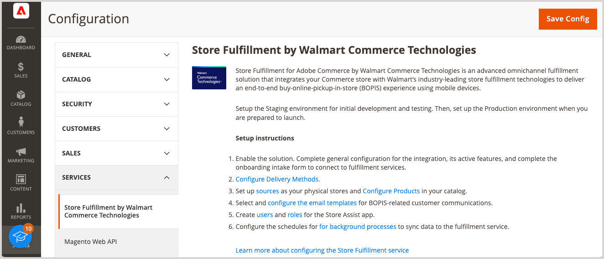

# Introduzione a [!DNL Store Fulfillment]

Store Fulfillment for Adobe Commerce by Walmart Commerce Technologies è una soluzione di implementazione omnicanale avanzata che si integra con [!DNL Commerce] negozio per offrire un acquisto superiore online, pick up in store (BOPIS) esperienza del cliente.

Il servizio di evasione del punto vendita offre inoltre un flusso di lavoro di evasione end-to-end che consente ai commercianti di ridurre i costi aumentando i tassi di conversione, il valore medio dell&#39;ordine e i tassi di soddisfazione del cliente. Questo flusso di lavoro offre:

* **Flessibilità omnicanale**- Trasforma magazzini e magazzini in punti di prelievo e centri di evasione.

* **Opzioni di prelievo del cliente**-Durante la selezione degli acquisti online, i clienti possono facilmente vedere la disponibilità dei prodotti e selezionare un negozio per il ritiro in-store o curbside.

* **Efficienza di evasione**- L&#39;applicazione mobile Store Assist consente ai soci del negozio di aumentare la velocità e la precisione di evasione degli ordini.

* **Comodità dei dispositivi mobili**-I clienti ricevono le notifiche degli ordini in ogni fase. Dalla conferma dell&#39;ordine al ritiro dell&#39;ordine, possono tenere traccia dello stato dell&#39;ordine, ottenere le istruzioni di check-in e comunicare con i soci del negozio quando arrivano al negozio.

* **Visibilità operativa**- Miglioramento dell&#39;allocazione delle scorte a livello di punto vendita per garantire un&#39;esecuzione locale tempestiva.

## Estensione Store Fulfillment

La soluzione Store Fulfillment supporta e migliora le funzionalità native di Adobe Commerce.

* Supporta la maggior parte dei tipi di prodotto: semplice, configurabile, raggruppato, in bundle e virtuale

* Si integra con [[!DNL Adobe Commerce] Inventory management](https://docs.magento.com/user-guide/catalog/inventory-learn-more.html)

* Integrazione con i sistemi di gestione delle scorte dei commercianti nei punti vendita (POS) come ERP, OMS e WMS

* Completamente compatibile con il tema Luma

* Compatibilità parziale con PWA e vetrine headless

* Supporta l&#39;app Store Assist di Walmart Commerce Technologies. Questa app consegna le informazioni dell&#39;ordine di prelievo direttamente al dispositivo palmare del dipendente nella posizione dello store selezionata. Grazie a queste informazioni, è possibile scegliere, posizionare nell&#39;area intermedia e consegnare gli articoli ai clienti in modo rapido e preciso quando arrivano al negozio.

## App assistenza store

L’app Store Assist per dispositivi iOS e Android™ interagisce con [!DNL Walmart Commerce Technologies] per offrire ai punti vendita funzionalità di distribuzione omnicanale.

* Invia ordini di ritiro in-store e in blocco direttamente ai dispositivi mobili degli associati al negozio

* Garantire che gli ordini dei punti vendita vengano selezionati in modo rapido e accurato, posizionati nell&#39;area intermedia e consegnati ai clienti quando arrivano al punto vendita per il ritiro dell&#39;ordine

* Gestire l&#39;accesso utente associato all&#39;archivio, inclusi i criteri di sicurezza, l&#39;autenticazione a due fattori e altro ancora

* Sincronizza automaticamente con Adobe Commerce i dati relativi alle ubicazioni e all’inventario dei negozi

## Esperienza utente migliorata

Store Fulfillment migliora Adobe Commerce aggiungendo funzionalità che consentono di migliorare le esperienze di acquisto e di semplificare i flussi di lavoro di evasione.

* **Selettore posizione archivio (SLS)**-Aggiunge alle pagine del prodotto e del carrello le opzioni di prelievo del negozio, la disponibilità dell&#39;inventario e i selettori del negozio, oltre al pagamento nativo.

* **Disponibilità inventario**-Aggiunge ulteriori opzioni di configurazione del prodotto e globale ad Adobe Commerce Inventory management. Queste opzioni supportano l&#39;allocazione dell&#39;inventario a livello di negozio per garantire una distribuzione locale tempestiva.

* **Miglioramenti al carrello e al pagamento**- Comunica ai clienti i tempi di ritiro, le posizioni e i costi più rapidi disponibili durante la sessione di acquisto online.

* **Flusso del processo di archiviazione**-Aggiunge interfacce per migliorare il processo di check-in del cliente e le interazioni con gli associati al negozio quando arrivano per il ritiro in-store o in blocco.

* **La mia cronologia account**-Estende il [!DNL Commerce] cronologia account per visualizzare i passaggi nella cronologia degli ordini.

* **E-mail transazionali**- Estende le funzionalità di amministrazione per [!UICONTROL Sales Emails] per aggiungere modelli e-mail per l&#39;acquisto online, preleva le transazioni nel negozio. I modelli supportano la comunicazione in tempo reale tra i clienti e gli associati al negozio durante il processo di prelievo dell’ordine.

* **Evasione flessibile**-Estensioni [!DNL Commerce] possibilità di supportare scenari per l&#39;elaborazione di ordini inevasi, riduzioni di quantità e evasione parziale degli ordini, facilitando al contempo gli annullamenti e le note di credito necessari per supportare tali scenari.

>[!TIP]
>
> Per una breve dimostrazione della soluzione Store Fulfillment, vedere [Panoramica sull&#39;evasione del negozio](https://experienceleague.adobe.com/docs/commerce-learn/tutorials/orders/store-fulfillment.html) disponibile in _Video e Tutorials di Adobe Commerce_.

